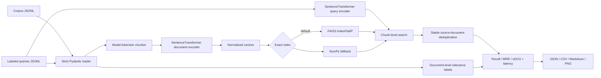
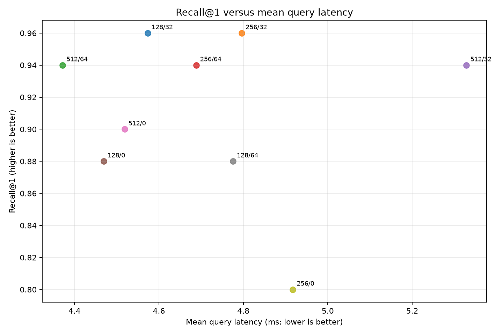

# RAG Retrieval Bench

[](https://github.com/Sahil-Arifi/rag-retrieval-bench/actions/workflows/ci.yml)
[](https://www.python.org/)
[](https://docs.astral.sh/ruff/)
[](LICENSE)

A reproducible Python harness for measuring how token chunk size and overlap affect
retrieval quality, index scale, construction cost, and query latency in a RAG pipeline.

This is an evaluation project, not an LLM API wrapper. It loads labeled data, chunks with
the selected embedding model's tokenizer, creates real sentence embeddings, builds an
exact cosine index, retrieves chunks, converts them to source-document rankings, computes
retrieval metrics from first principles, and generates machine- and human-readable reports.

> [!IMPORTANT]
> The included 12-document Asteria corpus is fictional demonstration data. Its results
> verify that the evaluation pipeline works; they are **not statistically meaningful** and
> must not be presented as a general benchmark of the embedding model.

## Why retrieval evaluation matters

Retrieval-augmented generation can only give an LLM evidence that the retriever finds.
Changing a chunk boundary may separate a question from its answer; increasing overlap may
restore that context but create more chunks, a larger index, and more repeated candidates.
An answer-quality review alone cannot tell whether a failure came from retrieval or from the
generator.

This project isolates that first stage. Each query has one or more relevant source-document
IDs, so a run can answer concrete questions:

- Did the retriever find every relevant source document?
- How early did the first relevant document appear?
- Did the full ranking put relevant documents near the top?
- What chunk-count and latency cost accompanied that quality?

## Architecture



The retriever searches all chunks for this exact demonstration benchmark, orders them by
cosine score, and retains the first/highest-scoring chunk for each `doc_id`. Metrics therefore
operate on a unique source-document ranking: extra chunks from one document cannot consume
multiple ranks or receive repeated relevance gain.

## What it measures

| Measurement | Definition |
|---|---|
| Recall@1/3/5/10 | Fraction of all relevant source documents found in the first *K* unique documents |
| RR / MRR@10 | Reciprocal rank of the first relevant document; macro-averaged across queries |
| DCG / nDCG@10 | Linear binary relevance discounted logarithmically and normalized by the ideal ranking |
| Mean / p95 latency | Single-query encoding + exact chunk search + document deduplication |
| Number of chunks | Corpus scale created by the chunk size and overlap |
| Build time | Document embedding + index construction; model loading and chunking are excluded |

The metric functions are implemented in this repository rather than delegated to a metrics
package. Rankings are stable-deduplicated defensively before each cutoff.

## Quick start

Requirements: CPython 3.11–3.14 on 64-bit Windows or Linux and
[`uv`](https://docs.astral.sh/uv/). The lockfile maps PyTorch to the CPU wheel index, avoiding
unnecessary CUDA dependencies.

```bash
git clone https://github.com/Sahil-Arifi/rag-retrieval-bench.git
cd rag-retrieval-bench
uv sync --frozen --python 3.11
```

Validate schemas, identifiers, relevance references, and every experiment pair without
loading or downloading a model:

```bash
uv run retrieval-bench validate --config configs/default.yaml
```

Run the full matrix and generate all artifacts:

```bash
uv run retrieval-bench run --config configs/default.yaml
```

Relative corpus, query, and output paths are interpreted from the invocation directory;
run the included configuration from the repository root.

## Dataset schema

The corpus and labels are newline-delimited JSON. IDs must be nonempty and unique, unknown
fields are rejected, and every relevance ID must exist in the corpus.

`corpus.jsonl`:

```json
{"id":"doc_001","title":"A source title","text":"The complete source text..."}
```

`queries.jsonl`:

```json
{"id":"q_001","query":"What does the source say?","relevant_doc_ids":["doc_001"]}
```

Multiple relevant documents are supported. The sample has 12 fictional procedure documents
and 25 queries, including two multi-document labels and controlled hard negatives with
overlapping vocabulary.

## Experiment configuration

[`configs/default.yaml`](configs/default.yaml) defines a Cartesian matrix:

```yaml
model:
  name: sentence-transformers/all-MiniLM-L6-v2
  batch_size: 64
  normalize_embeddings: true
  max_sequence_length: 512

dataset:
  corpus: data/sample/corpus.jsonl
  queries: data/sample/queries.jsonl

experiments:
  chunk_sizes: [128, 256, 512]
  chunk_overlaps: [0, 32, 64]

index:
  backend: faiss

evaluation:
  k_values: [1, 3, 5, 10]
  primary_metric: mrr@10

output:
  directory: artifacts
```

Every one of the 3 × 3 valid size/overlap combinations runs. An overlap greater than or
equal to its chunk size fails validation rather than being silently skipped.

Chunk sizes are total model-input token budgets. The chunker uses the selected model's exact
tokenizer, reserves slots for tokenizer-added special tokens, and records the content-token
count on each chunk. `all-MiniLM-L6-v2` ships with a conservative SentenceTransformers default
of 256 tokens, while its underlying transformer exposes 512 positional slots. This benchmark
explicitly sets 512, verifies that architectural limit at runtime, and refuses silent
truncation or any larger configured input.

## Verified sample benchmark

The table below comes from an actual local run on 2026-08-23 using Python 3.11.16,
SentenceTransformers 6.0.0, CPU-only PyTorch 2.13.0, FAISS CPU 1.15.0, and NumPy 2.4.6 on
Windows/AMD64. Latency is hardware- and load-dependent; the quality values belong only to the
included fictional labels.

Results are sorted by the configured primary metric (`MRR@10`), then mean query latency,
chunk count, chunk size, and overlap for deterministic tie-breaking.

| Rank | Size | Overlap | Chunks | Recall@1 | Recall@3 | Recall@5 | Recall@10 | MRR@10 | nDCG@10 | Mean ms | p95 ms | Build s |
|---:|---:|---:|---:|---:|---:|---:|---:|---:|---:|---:|---:|---:|
| 1 | 128 | 32 | 55 | 0.9600 | 0.9800 | 0.9800 | 1.0000 | 1.0000 | 0.9933 | 4.573 | 5.826 | 0.384 |
| 2 | 256 | 32 | 27 | 0.9600 | 0.9800 | 1.0000 | 1.0000 | 1.0000 | 0.9951 | 4.796 | 6.109 | 0.393 |
| 3 | 512 | 64 | 15 | 0.9400 | 1.0000 | 1.0000 | 1.0000 | 0.9800 | 0.9877 | 4.371 | 5.159 | 0.466 |
| 4 | 256 | 64 | 29 | 0.9400 | 0.9800 | 1.0000 | 1.0000 | 0.9800 | 0.9850 | 4.688 | 6.225 | 0.413 |
| 5 | 512 | 32 | 15 | 0.9400 | 1.0000 | 1.0000 | 1.0000 | 0.9800 | 0.9877 | 5.329 | 7.480 | 0.466 |
| 6 | 128 | 0 | 45 | 0.8800 | 0.9800 | 1.0000 | 1.0000 | 0.9600 | 0.9645 | 4.469 | 5.821 | 0.332 |
| 7 | 512 | 0 | 15 | 0.9000 | 1.0000 | 1.0000 | 1.0000 | 0.9600 | 0.9730 | 4.519 | 5.885 | 0.464 |
| 8 | 128 | 64 | 75 | 0.8800 | 0.9800 | 1.0000 | 1.0000 | 0.9600 | 0.9656 | 4.775 | 6.192 | 0.519 |
| 9 | 256 | 0 | 27 | 0.8000 | 0.9800 | 1.0000 | 1.0000 | 0.9200 | 0.9360 | 4.917 | 6.254 | 0.385 |

By the configured selection rule, **128 tokens with 32-token overlap** was best: MRR@10
`1.0000`, mean latency `4.573 ms`, p95 latency `5.826 ms`, and 55 chunks. The 256/32 run
also reached MRR@10 `1.0000`; it ranked second because its measured mean latency was higher.
This comparison is an observation from the sample run, not evidence that 128/32 generalizes.



The chart uses Recall@1 because Recall@10 saturated at `1.0000` for all nine sample runs.
Exact outputs are committed as
[`results.json`](artifacts/results.json),
[`results.csv`](artifacts/results.csv), and
[`report.md`](artifacts/report.md).

## Testing and CI

Unit tests use `FakeEmbedder`, a deterministic hashing embedder with a reversible whitespace
tokenizer. Importing the package, validating data, and running tests never require a model
download.

```bash
uv run pytest
uv run ruff check .
```

Verified locally:

```text
84 passed in 1.57s
Required test coverage of 85% reached. Total coverage: 91.15%
All checks passed!
```

The GitHub Actions matrix runs on Ubuntu and Windows with Python 3.11 and 3.14. It verifies
the lockfile, performs a frozen sync, smoke-tests the binary FAISS/NumPy/Torch stack, forces
Hugging Face and Transformers offline, then runs Ruff and pytest on pushes and pull requests.

Tests cover:

- malformed/empty JSONL, strict schemas, duplicate IDs, and missing relevance references;
- exact token boundaries, overlap, special-token capacity, deterministic IDs, and no empty chunks;
- FAISS/NumPy cosine-ranking equivalence, normalization, tie-breaking, and invalid vectors;
- Recall@K, RR/MRR, DCG, and nDCG formulas with document deduplication;
- a deterministic multi-configuration evaluator with injected timing and `FakeEmbedder`;
- CLI success/failure behavior without model construction; and
- deterministic best-run selection plus all four reporting artifacts.

## Project structure

```text
.
├── .github/workflows/ci.yml
├── configs/default.yaml
├── data/sample/
│   ├── corpus.jsonl
│   └── queries.jsonl
├── src/retrieval_bench/
│   ├── cli.py             # Typer commands and Rich progress
│   ├── config.py          # strict YAML configuration
│   ├── dataset.py         # JSONL and relevance validation
│   ├── chunking.py        # model-tokenizer windows
│   ├── embeddings.py      # SentenceTransformer + FakeEmbedder
│   ├── indexing.py        # FAISS and NumPy exact indexes
│   ├── retrieval.py       # chunk search -> document ranking
│   ├── metrics.py         # metrics implemented from first principles
│   ├── evaluator.py       # experiment matrix and timing
│   ├── reporting.py       # JSON/CSV/Markdown/PNG outputs
│   └── models.py          # immutable Pydantic records
├── tests/
├── artifacts/
├── pyproject.toml
└── uv.lock
```

## Engineering decisions

- **Relevance is document-level.** The index returns chunks, but evaluation keeps only the
  best chunk from each source document before assigning document ranks.
- **Document ranking is exact.** The demonstration retriever searches all chunks before
  deduplication, so repeated chunks cannot hide a lower-ranked document. There is no silent
  FAISS-to-NumPy fallback.
- **Cosine semantics are shared.** Both indexes reject invalid/zero vectors, normalize
  `float32` rows, use inner product, clamp oversized `k`, and apply a stable score/index order.
- **Timing boundaries are explicit.** Model loading, warmup, chunking, and report generation
  are excluded; single-query encoding is included.
- **Dependencies are reproducible.** Direct binary-stack ranges are narrow, `uv.lock` is the
  exact authority, PyTorch resolves from the CPU index, and prereleases are disallowed.
- **Reports avoid unsupported claims.** JSON preserves full precision and configuration;
  Markdown and the README label the sample as demonstration-only.

## Limitations

- The synthetic corpus is tiny, domain-specific, and deliberately answerable. It cannot
  estimate production quality or compare embedding models generally.
- Latencies are one local CPU pass with no repeated trials, confidence intervals, concurrency,
  cold-cache study, or GPU measurements.
- Exact all-chunk search produces a correct document ranking for this harness but does not
  scale to millions of chunks; adaptive over-fetch or document-aware ANN retrieval is needed.
- Only one dense encoder and cosine retrieval are benchmarked. There is no BM25/hybrid stage,
  approximate index, metadata filtering, cross-encoder reranking, or end-to-end generation.
- The 512-token experiment deliberately extends MiniLM from its packaged 256-token default to
  its verified 512-position architecture. A natively trained long-context encoder is a better
  choice for drawing conclusions about long chunks.

## Future improvements

The highest-value next feature is a **BEIR-compatible multi-dataset runner with repeated trials
and bootstrap confidence intervals**. That would turn the harness from a pipeline demonstration
into evidence across domains while preserving the same document-level evaluation contracts.

Further extensions include ANN/HNSW indexes, BM25 and hybrid retrieval, cross-encoder reranking,
query/document prompt strategies, metadata filters, memory profiling, and paired significance
tests between configurations.

## License

[MIT](LICENSE)
